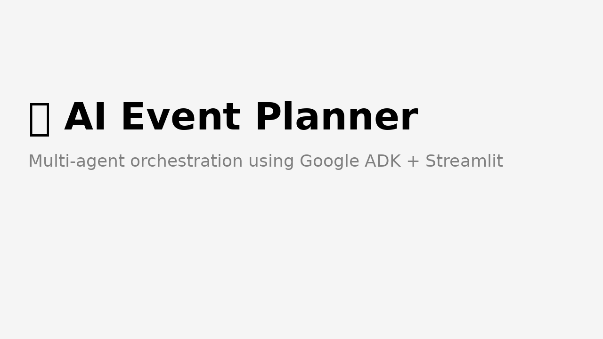

# 🎉 AI Event Planner

Plan weddings, birthdays, and corporate events using multi-agent AI orchestration powered by **Google ADK**, **OpenAI**, and **Streamlit**.



> Built for developers, planners, and creators who want to see AI in action — with real visual output, speech, and proposal exports.

---

## 💡 Features

- ✨ Intelligent venue and catering suggestions by city
- 🗺️ Dynamic country/city selector (via Google Maps API)
- 🍽️ Budget-aware catering filtering
- 🎨 AI-generated invitation text + downloadable card (via DALL·E)
- 🖼️ Interior design visual preview from event theme (via DALL·E)
- 🕒 Auto-generated timeline per event type (wedding, birthday, etc.)
- 🔊 Voice invitation using ElevenLabs (via TTS API)
- 🤝 Sponsorship suggestions based on city + theme
- 📄 PDF summary export of full event plan
- 📦 Modular agent loading powered by Google ADK
- 🧠 Designed for teaching multi-agent orchestration

---

## 🧪 Tech Stack

- **Google ADK** — multi-agent orchestration
- **Streamlit** — frontend UI
- **OpenAI (GPT + DALL·E)** — LLM planning + image generation
- **Google Maps API** — live city data
- **ElevenLabs API** — voice generation
- **ReportLab** — exportable PDF output

---

## 🚀 Getting Started

```bash
git clone https://github.com/atef-ataya/ai-event-planner
cd ai-event-planner
pip install -r requirements.txt
streamlit run app.py
```
# 🎉 AI Event Planner

Plan weddings, birthdays, and corporate events using multi-agent AI orchestration powered by **Google ADK**, **OpenAI**, and **Streamlit**.


> Built for developers, planners, and creators who want to see AI in action — with real visual output, speech, and proposal exports.

---

## 💡 Features

- ✨ Intelligent venue and catering suggestions by city
- 🗺️ Dynamic country/city selector (via Google Maps API)
- 🍽️ Budget-aware catering filtering
- 🎨 AI-generated invitation text + downloadable card (via DALL·E)
- 🖼️ Interior design visual preview from event theme (via DALL·E)
- 🕒 Auto-generated timeline per event type (wedding, birthday, etc.)
- 🔊 Voice invitation using ElevenLabs (via TTS API)
- 🤝 Sponsorship suggestions based on city + theme
- 📄 PDF summary export of full event plan
- 📦 Modular agent loading powered by Google ADK
- 🧠 Designed for teaching multi-agent orchestration

---

## 🧪 Tech Stack

- **Google ADK** — multi-agent orchestration
- **Streamlit** — frontend UI
- **OpenAI (GPT + DALL·E)** — LLM planning + image generation
- **Google Maps API** — live city data
- **ElevenLabs API** — voice generation
- **ReportLab** — exportable PDF output

---

## 🚀 Getting Started

```bash
git clone https://github.com/atef-ataya/ai-event-planner
cd ai-event-planner
pip install -r requirements.txt
streamlit run app.py
```